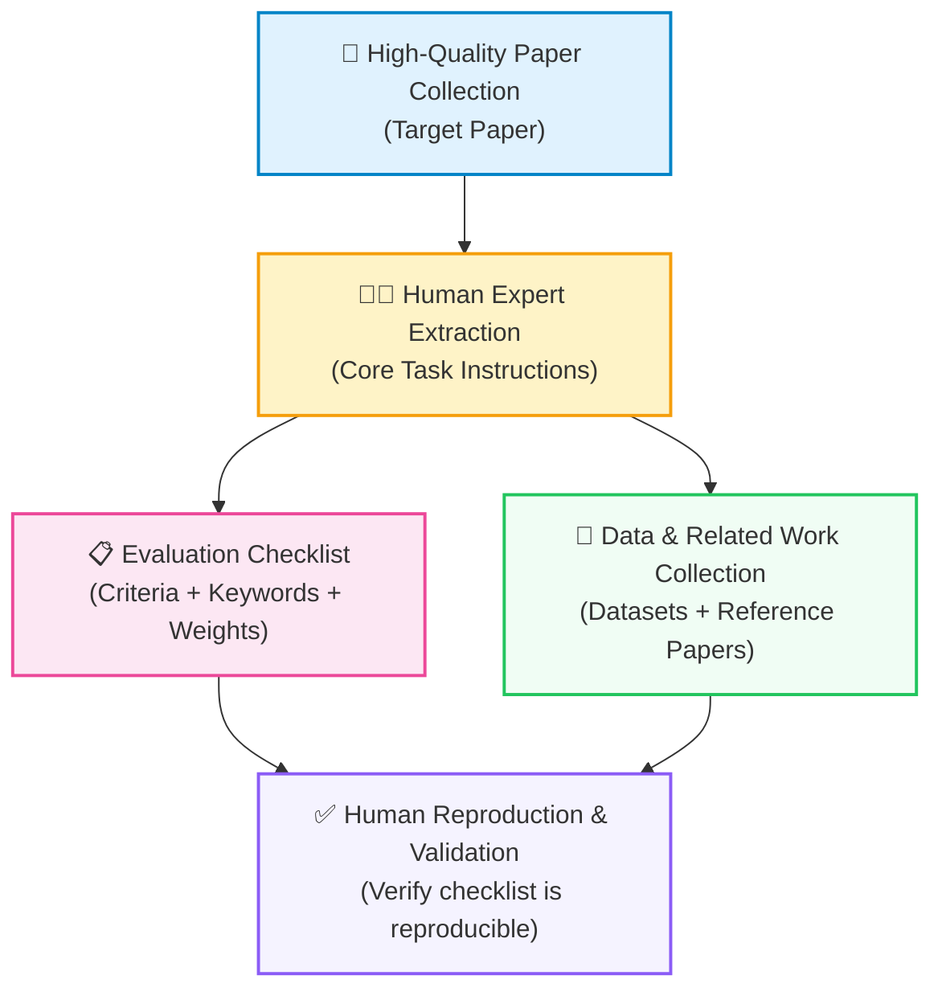
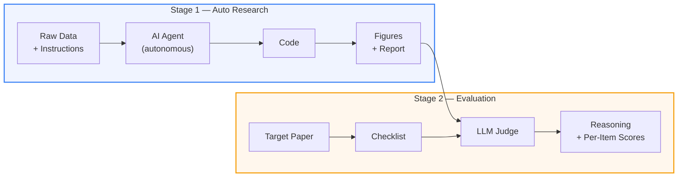
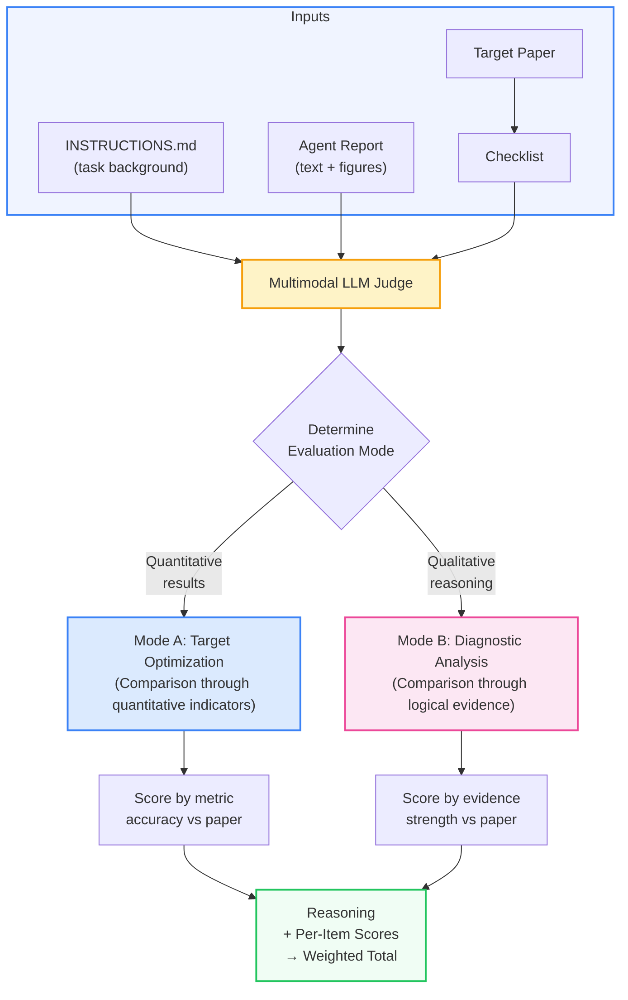

<div align="center">
  <h1>ResearchClawBench</h1>
</div>

<div align="center">

[](https://InternScience.github.io/ResearchClawBench-Home/)&#160;
[](https://github.com/InternScience/ResearchClawBench)&#160;
[](https://huggingface.co/datasets/InternScience/ResearchClawBench)&#160;
&#160;
[](LICENSE)
[](#-scientific-domains)
[](#-scientific-domains)
[](https://github.com/InternScience/ResearchClawBench)

**Evaluating AI Agents for Automated Research from Re-Discovery to New-Discovery**


[Quick Start](#-quick-start) | [Submit Tasks](#-submit-new-tasks) | [How It Works](#%EF%B8%8F-how-it-works) | [Domains](#-scientific-domains) | [Leaderboard](#-leaderboard) | [Add Your Agent](#-add-your-own-agent)

</div>

<p align="center">
  
</p>

---

ResearchClawBench is a benchmark that measures whether AI coding agents can **independently conduct scientific research** — from reading raw data to producing publication-quality reports — and then rigorously evaluates the results against **real human-authored papers**.

Unlike benchmarks that test coding ability or factual recall, ResearchClawBench asks: *given a curated scientific workspace and the same research goal, can an AI agent arrive at the same (or better) scientific conclusions?*

## Overview

### ✨ Highlights

<table>
<tr>
<td align="center" width="25%">🔄<br/><b>Two-Stage Pipeline</b><br/><sub>Autonomous research + rigorous peer-review-style evaluation</sub></td>
<td align="center" width="25%">🧪<br/><b>40 Real-Science Tasks</b><br/><sub>10 disciplines, curated datasets from published papers</sub></td>
<td align="center" width="25%">👁️<br/><b>Expert-Annotated Data</b><br/><sub>Tasks, checklists & datasets curated by domain experts</sub></td>
<td align="center" width="25%">🤖<br/><b>Multi-Agent Support</b><br/><sub>Claude Code, Codex CLI, OpenClaw, ResearchClaw, ... & custom agents</sub></td>
</tr>
<tr>
<td align="center">🚀<br/><b>Re-Discovery to New-Discovery</b><br/><sub>50 = match the paper, 70+ = surpass it</sub></td>
<td align="center">📋<br/><b>Fine-Grained Checklist</b><br/><sub>Per-item keywords, weights & reasoning</sub></td>
<td align="center">📡<br/><b>Live Streaming UI</b><br/><sub>Watch agents code, plot & write in real-time</sub></td>
<td align="center">🍃<br/><b>Lightweight Dependencies</b><br/><sub>Pure Flask + vanilla JS, no heavy frameworks</sub></td>
</tr>
</table>

### 🎬 Demo

https://github.com/user-attachments/assets/94829265-80a8-4d61-a744-3800603de6d9

### 💡 Why ResearchClawBench?

Most AI benchmarks evaluate what models **know**. We evaluate what agents can **do**.

- **Real science, not toy problems.** 40 tasks sourced from published papers across 10 disciplines, each with curated experimental datasets.
- **Two-stage pipeline.** Autonomous research first, rigorous evaluation second — just like peer review.
- **Fine-grained, multimodal scoring.** A weighted checklist with text and image criteria, judged by an LLM acting as a strict peer reviewer.
- **Agent-agnostic.** Ships with built-in support for Claude Code, Codex CLI, ARIS Codex, OpenClaw, Nanobot, EvoScientist, ResearchClaw, and a lightweight ResearchHarness baseline. Bring your own agent in one line.
- **From Re-Discovery to New-Discovery.** Scoring above 50 means matching the original paper; above 70 means *surpassing* it. The frontier is wide open.

### 📢 News

- **2026-06-02** 📊 Evaluated Claude-Opus-4.8 as an additional standalone LLM with [ResearchHarness](https://huggingface.co/spaces/InternScience/ResearchHarness). Results are available on the [Leaderboard](https://internscience.github.io/ResearchClawBench-Home/).
- **2026-05-28** 📊 Evaluated two additional standalone LLMs with [ResearchHarness](https://huggingface.co/spaces/InternScience/ResearchHarness): Gemini-3.5-Flash and Qwen3.7-Max. Results are available on the [Leaderboard](https://internscience.github.io/ResearchClawBench-Home/).
- **2026-05-21** 📊 Evaluated four additional standalone LLMs with [ResearchHarness](https://huggingface.co/spaces/InternScience/ResearchHarness): Grok-4.3, Kimi-K2.6, MiMo-V2.5, and DeepSeek-V4-Pro. Results are available on the [Leaderboard](https://internscience.github.io/ResearchClawBench-Home/).
- **2026-04-30** 📊 Evaluated standalone LLMs with [ResearchHarness](https://huggingface.co/spaces/InternScience/ResearchHarness): Claude-Opus-4.7, Claude-Opus-4.6, GLM-5.1, Qwen3.6-Plus, Qwen3.5-397B-A17B, GPT-5.5, GPT-5.4, MiMo-V2-Pro, Kimi-K2.5, Grok-4.1, and Gemini-3.1-Pro. Results are available on the [Leaderboard](https://internscience.github.io/ResearchClawBench-Home/).
- **2026-04-13** 🧭 Added built-in [ARIS Codex](https://github.com/wanshuiyin/Auto-claude-code-research-in-sleep) UI support and documentation. Imported benchmark runs are supported in the leaderboard and run browser; one-click launch is not yet supported in the public preset.
- **2026-04-10** 🔬 Added built-in [ResearchClaw](https://github.com/ymx10086/ResearchClaw) support — an intelligent agent-powered research assistant with built-in skills for paper search, literature review, and data analysis.
- **2026-04-07** 🧪 Added built-in [ResearchHarness](https://huggingface.co/spaces/InternScience/ResearchHarness) support as a lightweight baseline agent for testing different LLMs under the same ResearchClawBench workflow.
- **2026-03-30** 🧬 Added built-in [EvoScientist](https://github.com/EvoScientist/EvoScientist) support and clarified multimodal judge prompting so the first attached image is explicitly treated as the ground-truth figure.
- **2026-03-27** 🤗 Released a Hugging Face dataset mirror at [InternScience/ResearchClawBench](https://huggingface.co/datasets/InternScience/ResearchClawBench), including 10 additional tasks from ResearchClawBench-Self and a task downloader script.
- **2026-03-27** 📨 Opened the [ResearchClawBench submission Space](https://huggingface.co/spaces/InternScience/ResearchClawBench-Task-Submit) for community task uploads. New tasks are validated there and reviewed through Hugging Face dataset PRs instead of being added to this GitHub repository.
- **2026-03-20** 🐈 Added [Nanobot](https://github.com/HKUDS/nanobot) as a new agent — ultra-lightweight OpenClaw alternative with reliable multi-step tool execution. Agent config moved to `agents.json` for easy customization.
- **2026-03-19** 🚀 Initial release with Claude Code, Codex CLI, and OpenClaw support. 40 tasks across 10 scientific domains.

---

## Understanding The Benchmark

### 🏗️ Data Construction

Every task in ResearchClawBench is built through a rigorous, expert-driven pipeline to ensure scientific validity and reproducibility:



1. **High-Quality Paper Collection** — Domain experts select recent, high-impact publications with clear methodology and reproducible results across 10 scientific disciplines.

2. **Expert Task Extraction** — Human experts read each paper and distill the core research task into structured instructions, identifying the key scientific question, input data, and expected outputs.

3. **Checklist Design** — Experts create a fine-grained evaluation checklist with weighted criteria (text and image items), each with specific technical keywords that a judge must verify.

4. **Data & Related Work Collection** — The datasets and related reference materials are curated to form a research workspace for the task.

5. **Human Reproduction & Validation** — Human researchers independently reproduce the paper's results from the provided workspace and instructions, verifying that every checklist item is achievable. This ensures the benchmark is fair and the checklist is grounded in reality.

### ⚙️ How It Works

ResearchClawBench operates in two distinct stages:



#### Stage 1: Autonomous Research

<div align="center">

<p><em>Auto Research view — file explorer, live code output, and real-time agent conversation</em></p>
</div>

The AI agent receives a workspace containing raw datasets, reference materials, and task instructions. It must independently:

1. **Explore** the data and understand the research question
2. **Write code** to analyze, model, and visualize the data
3. **Produce a research report** (`report/report.md`) with figures, methodology, results, and discussion

No hand-holding. No chain-of-thought hints. The agent works in its own sandboxed workspace with full tool access — just like a real researcher.

#### Stage 2: Reference-Based Evaluation

<div align="center">

<p><em>Evaluation view — target paper (left), AI report (center), scored checklist (right)</em></p>
</div>

Once the agent finishes, its report is evaluated against the **original published paper** using a fine-grained checklist. The judge receives the task instructions, the AI report, and the checklist criteria — then scores each item using a **dual-mode rubric**:



Each checklist item includes:
- **Specific criteria** extracted from the paper's key contributions
- **Technical keywords** the judge must verify (e.g., *"ROC-AUC improvement"*, *"Monte Carlo integration"*)
- **Weight** reflecting the item's importance
- **Type** — `text` for methodology/findings, `image` for figure comparison (multimodal vision)

The judge automatically determines which evaluation mode applies to each item, then scores it with the corresponding rubric (see below).

##### Mode A: Target Optimization (Comparison through quantitative indicators)

For checklist items involving specific numerical results, metrics, or quantitative outcomes:

| Score | Meaning |
|:------|:--------|
| **0** | Criterion completely absent |
| **1–10** | Mentioned but no quantitative results provided |
| **11–20** | Results given but methodology has fundamental errors |
| **21–30** | Significant methodological flaws; metrics deviate severely |
| **31–40** | Methodology mostly correct but metrics notably worse than the paper |
| **41–50** | **Metrics roughly comparable to the paper** |
| **51–60** | Metrics slightly better than the paper |
| **61–70** | Metrics clearly better than the paper |
| **71–80** | Methodology and metrics both substantially improved |
| **81–90** | Metrics dramatically surpass the paper |
| **91–100** | Breakthrough results far exceeding the paper |

##### Mode B: Diagnostic Analysis (Comparison through logical evidence)

For checklist items involving theoretical explanations, mechanistic insights, or interpretive analysis:

| Score | Meaning |
|:------|:--------|
| **0** | Criterion completely absent |
| **1–10** | Mentioned only with vague, generic statements |
| **11–20** | Some description but no substantive analysis |
| **21–30** | Analysis attempted but evidence insufficient or logic has gaps |
| **31–40** | Correct direction but lacks depth; key arguments missing |
| **41–50** | **Analysis depth and rigor comparable to the paper** |
| **51–60** | More supporting evidence provided than the paper |
| **61–70** | More complete logical chain and more rigorous argumentation |
| **71–80** | Significantly deeper analysis with novel insights |
| **81–90** | Analysis depth far exceeds the paper |
| **91–100** | Original contributions with breakthrough insights |

> **Strict by design.** The judge is highly skeptical of AI-generated content — plausible-sounding claims must be backed by concrete evidence. Longer reports do not score higher. Substance over style.

### 🔬 Scientific Domains

Each domain contains **4 carefully curated tasks** with complete experimental data from real published research:

| Domain | Example Topics | Data Types |
|:---|:---|:---|
| **Astronomy** | Black hole superradiance, Bayesian stellar inference | `.dat`, `.csv` |
| **Chemistry** | GNN molecular prediction, protein-ligand docking | `.pdb`, `.sdf`, `.csv` |
| **Earth** | Glacier mass balance, climate datasets | `.csv`, multi-region series |
| **Energy** | Battery degradation, renewable energy modeling | `.xlsx`, time series |
| **Information** | NLP benchmarks, deep learning analysis | `.pdf`, `.tex`, `.ipynb` |
| **Life** | Nanopore sequencing, genomic analysis | `.csv`, `.xlsx` |
| **Material** | Materials property prediction, pretrained models | `.pt`, `.csv` |
| **Math** | Multi-agent pathfinding, optimization | `.json`, `.npy`, grid maps |
| **Neuroscience** | Neural decoding, brain signal processing | `.csv`, `.h5`, `.yaml` |
| **Physics** | Quantum geometry, superfluid stiffness | `.h5`, `.json`, `.csv` |

**40 tasks total** — each a curated research challenge selected from high-quality human-authored publications, spanning the full spectrum from data analysis to novel scientific insight.

### 🏆 Leaderboard

You can view the leaderboard on our [Website](https://internscience.github.io/ResearchClawBench-Home/), which is **updated in real time**.

<div align="center">

<p><em>Leaderboard</em></p>
</div>

The built-in dashboard aggregates the best score per (task, agent) pair and displays:

- **Frontier chart** — best score per task across all agents
- **Leaderboard table** — clickable cells linking to individual runs
- **Per-task breakdown** — view any agent's report, code, and score reasoning

The frontier represents the **state of the art** — every point above 50 is uncharted territory where AI surpasses human researchers on that specific task.

### 📁 Project Structure

```
ResearchClawBench/
├── evaluation/                 # Core evaluation framework
│   ├── server.py               # Flask API + SSE streaming
│   ├── run_task.py             # Workspace setup + agent subprocess
│   ├── score.py                # Multimodal LLM scoring engine
│   ├── config.py               # Paths, constants, loads agents.json
│   ├── agents.json             # Agent presets (add your own here)
│   ├── instructions_tmpl.py    # Unified prompt template for all agents
│   ├── utils.py                # File tree, path safety, discovery
│   ├── static/app.js           # Single-file frontend
│   └── templates/index.html    # Entry point
├── tasks/                      # 40 research tasks
│   ├── Astronomy_000/
│   │   ├── task_info.json      # Task description + data manifest
│   │   ├── data/               # Raw experimental datasets
│   │   ├── related_work/       # Reference papers
│   │   └── target_study/       # Paper + checklist + images
│   ├── Chemistry_000/
│   └── ...                     # 10 domains x 4 tasks
└── workspaces/                 # Generated at runtime (gitignored)
```

---

## Using ResearchClawBench

### 🚀 Quick Start

#### 1. Install

```bash
git clone https://github.com/InternScience/ResearchClawBench.git
# If you only need to run evaluations, you can instead use:
# git clone --depth 1 https://github.com/InternScience/ResearchClawBench.git
cd ResearchClawBench
pip install -r evaluation/requirements.txt
```

#### 2. Download Additional Hugging Face Tasks (Optional)

The Hugging Face dataset mirror at [InternScience/ResearchClawBench](https://huggingface.co/datasets/InternScience/ResearchClawBench) currently includes **16 community-contributed tasks beyond the 40 tasks in this repository**, all packaged in the same `tasks/<TaskID>/...` layout.

If you want to use these extra tasks directly in this repository, set `--output-dir` to your local `tasks/` directory.

Download the helper script:

```bash
pip install huggingface_hub
curl -L -o download_tasks.py https://huggingface.co/datasets/InternScience/ResearchClawBench/resolve/main/download_tasks.py
```

Download all mirrored Hugging Face tasks:

```bash
python download_tasks.py --all --output-dir /path/to/ResearchClawBench/tasks
```

Download one or more specific tasks:

```bash
python download_tasks.py --task Astronomy_004 --task Physics_004 --output-dir /path/to/ResearchClawBench/tasks
```

The downloaded files are placed directly under that tasks directory, for example `/path/to/ResearchClawBench/tasks/Astronomy_004/...`.

Any task directory placed under `tasks/` with a valid `task_info.json` will be discovered automatically by the evaluation UI/API.

#### 3. Configure

Create `evaluation/.env` with your scoring model credentials:

```env
OPENAI_API_KEY=sk-xxx
OPENAI_BASE_URL=https://api.openai.com/v1
SCORER_MODEL=gpt-5.1
```

#### 4. Install Agents

Install whichever agent(s) you plan to benchmark. You do not need every built-in preset.

| Agent | Official installation guide | Notes |
|:------|:----------------------------|:------|
| **Claude Code** | [Claude Code overview](https://code.claude.com/docs/en/overview) | Anthropic official docs |
| **Codex CLI** | [Codex CLI](https://developers.openai.com/codex/cli) | OpenAI official docs |
| **ARIS Codex** | [Auto-claude-code-research-in-sleep](https://github.com/wanshuiyin/Auto-claude-code-research-in-sleep) | Imported runs are supported in the UI. The public preset is documentation-only for now; one-click launch is not yet supported. |
| **OpenClaw** | [OpenClaw](https://openclaw.ai/) | Official website and setup entry |
| **Nanobot** | [HKUDS/nanobot](https://github.com/HKUDS/nanobot) | Official GitHub repository |
| **EvoScientist** | [EvoScientist/EvoScientist](https://github.com/EvoScientist/EvoScientist) | Official GitHub repository |
| **ResearchClaw** | [ymx10086/ResearchClaw](https://github.com/ymx10086/ResearchClaw) | `pip install researchclaw` |
| **ResearchHarness** | [InternScience/ResearchHarness](https://github.com/InternScience/ResearchHarness) | Lightweight baseline harness for testing different LLMs; replace `/abs/path/to/ResearchHarness` in `agents.json` |

#### 5. Launch

```bash
python -m evaluation
```

Open **http://localhost:5000** — browse tasks, pick an agent, hit **Start Run**, and watch the research happen live.

#### 6. Score

After a run completes, switch to the **Evaluation** tab and click **Score**. The multimodal LLM judge evaluates each checklist item and returns per-item scores with reasoning.

### 🤖 Supported Agents

ResearchClawBench ships with built-in support for Claude Code, Codex CLI, ARIS Codex, OpenClaw, Nanobot, EvoScientist, ResearchClaw, plus a lightweight ResearchHarness baseline:

| Agent | Command | Notes |
|:------|:--------|:------|
|  **Claude Code** | `claude -p ...` | Anthropic, stream-JSON output |
|  **Codex CLI** | `codex exec --full-auto ...` | OpenAI, full-auto mode |
|  **ARIS Codex** | `One-click launch is not yet supported.` | Historical imported runs are supported in the UI; add your own local wrapper if you want to benchmark it interactively. |
|  **OpenClaw** | `openclaw agent ...` | Self-hosted gateway, 3600s timeout |
|  **Nanobot** | `nanobot agent -m ...` | Ultra-lightweight, reliable tool execution |
|  **EvoScientist** | `evosci --ui cli ...` | Self-evolving AI Scientists |
|  **ResearchClaw** | `researchclaw agent -m ...` | AI research assistant with built-in skills |
|  **ResearchHarness** | `python3 /abs/path/to/ResearchHarness/run_agent.py ...` | Lightweight baseline harness for testing different LLMs |

#### 🔧 Add Your Own Agent

Agent configuration is stored in `evaluation/agents.json`. To add a new agent, simply append an entry:

```json
{
  "my_agent": {
    "label": "My Agent",
    "icon": "M",
    "logo": "/static/logos/my_agent.svg",
    "cmd": "my-agent run -m <PROMPT> -w <WORKSPACE>"
  }
}
```

| Placeholder | Replaced With | Notes |
|:---|:---|:---|
| `<PROMPT>` | Prompt content (via file path or `$(cat ...)`) | Required. For `-p` style flags, replaced with file path; otherwise replaced with `"$(cat 'path')"` to pass content |
| `<WORKSPACE>` | Absolute path to the workspace directory | Optional. Only replaced if present in cmd |

The prompt injected into `<PROMPT>` is auto-generated from `evaluation/instructions_tmpl.py`, which combines a unified agent persona (autonomous execution guidelines, workspace sandbox rules) with task-specific instructions (description, data files, deliverables). All agents receive the exact same prompt — no code changes required, just edit the JSON file and restart the server.

### 📨 Submit New Tasks

The GitHub benchmark repository stays focused on the base 40 tasks. New task submissions should go through the [ResearchClawBench submission Space](https://huggingface.co/spaces/InternScience/ResearchClawBench-Task-Submit), which validates the uploaded zip and opens a PR against the [Hugging Face dataset repository](https://huggingface.co/datasets/InternScience/ResearchClawBench) for maintainer review.

- Submission Space: [InternScience/ResearchClawBench-Task-Submit](https://huggingface.co/spaces/InternScience/ResearchClawBench-Task-Submit)
- Dataset destination: [InternScience/ResearchClawBench](https://huggingface.co/datasets/InternScience/ResearchClawBench)
- Example task format: [tasks/Astronomy_000](https://github.com/InternScience/ResearchClawBench/tree/main/tasks/Astronomy_000)

After a submission is merged into the dataset repository, you can download it into your local `tasks/` directory with `download_tasks.py`, and the evaluation UI/API will discover it automatically.

---

## Community

### 🤝 Contributing

We welcome contributions in several forms — see [CONTRIBUTING.md](CONTRIBUTING.md) for detailed guidelines.

- **New tasks** — Add research challenges in existing or new domains
- **New agents** — Add presets for emerging coding agents
- **Bug reports** — Open an issue

📧 **Email**: [xu_wanghan@sjtu.edu.cn](https://black-yt.github.io/)

📬 **Community**:

<p align="center">
  
  &nbsp;&nbsp;&nbsp;&nbsp;
  
</p>

### 📜 Citation

If you would like to cite our work, please use the following BibTeX.

```bib
@software{Xu_ResearchClawBench_Evaluating_AI_2026,
  author = {Xu, Wanghan and Li, Shuo and Ye, Tianlin and Cao, Qinglong and Chen, Yixin and Gao, Hengjian and Wang, Yiheng and Li, Qi and Li, Kun and Xu, Sheng and Chai, Shengdu and Yu, Fangchen and Zhao, Xiangyu and Zhao, Zhangrui and Ma, Weijie and Guo, Zijie and Zhou, Haoyu and Yin, Haoxiang and Cheng, Lixue and Hu, Chaofan and Li, Haoxuan and Mi, Lu and Xie, Xuxuan and Zhou, Yifan and Chen, Ruizhe and Zhou, Zhiwang and Guo, Xingjian and Zhou, Yuhao and He, Xuming and Xu, Shengyuan and Gu, Xinyu and Wu, Jiamin and Liu, Mianxin and Song, Chunfeng and Ling, Fenghua and Zhou, Dongzhan and Tang, Shixiang and Li, Yuqiang and Su, Mao and Ye, Peng and Sun, Siqi and Fu, Tianfan and Wang, Bin and Yang, Xue and Yin, Zhenfei and Zhai, Guangtao and Ouyang, Wanli and Zhang, Bo and Bai, Lei and Zhang, Wenlong},
  license = {MIT},
  month = mar,
  title = {{ResearchClawBench: Evaluating AI Agents for Automated Research from Re-Discovery to New-Discovery}},
  url = {https://github.com/InternScience/ResearchClawBench},
  year = {2026}
}
```

### ⭐ Star History

<a href="https://www.star-history.com/?repos=InternScience%2FResearchClawBench&type=date&legend=top-left">
 <picture>
   <source media="(prefers-color-scheme: dark)" srcset="https://api.star-history.com/image?repos=InternScience/ResearchClawBench&type=date&theme=dark&legend=top-left" />
   <source media="(prefers-color-scheme: light)" srcset="https://api.star-history.com/image?repos=InternScience/ResearchClawBench&type=date&legend=top-left" />
   
 </picture>
</a>

<p align="right"><a href="#top">🔝Back to top</a></p>
